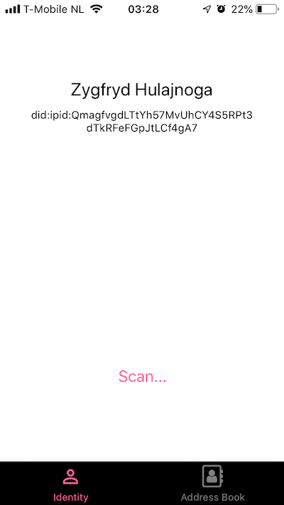

## Experience Identity Box

If you are invited to our Early Adoption Program via [TestFlight](https://developer.apple.com/testflight/) you can help us evaluating Identity Box even before actual boxes are made available.

For this purpose, specially for our early adopters, we created a *virtual* Identity Box that can be used when testing the IdentityBox app.

When you start your IdentityBox app for the first time, you will be asked to scan your Identity Box's QRCode in order to establish a one-to-one connection between your Identity Box app and your Identity Box:

 

  

<b>Figure 1</b> Connect to Identity Box

Here, we want you to use our virtual Identity Box by scanning the following QRCode:

 

  

<b>Figure 2</b> Virtual Identity Box QRCode

After scanning this QRCode, you will be able to create your first identity. Future test versions will let you create multiple identities and conveniently switch between them, but for now, we only allow for one identity:

 

  

<b>Figure 3</b> Create your first identity

At this early stage, we require that your "easy to remember" name to be unique - we recommend you to use your full name or some identifier that you can consider unique. If you name is already use by another tester, creating your Identity will fail and the app at its current stage does not handle bad-weather scenario well. If you after providing the name and pressing *Create* the app does not move to the next screen, please kill the app, start it again, and try a different name. The following builds will provide better handling of conflicts and enable switching between boxes, so this problem is only temporary and not highly relevant at this initial testing phase.

After your name is successfully created (this happens normally very fast), you will see the following screen (here I used the name *Zygfryd Hulajnoga*):

 

  

<b>Figure 4</b> Current Identity View

You can now also open *Address Book* tab, to see your own, and your peer identities:

 

  

<b>Figure 5</b> Address Book

By selecting an identity in the address book, you can see its details, and more importantly, you can share
identity with your peers by letting them scan the QRCode visible in the Identity Details view.

You add peer identities to your address book by scanning QRCode of your peers from the Current Identity view and the by adding a descriptive name to your new *contact* - this new name never leaves your mobile.

 

  

<b>Figure 6</b> Adding Peer Identity

Currently, you can only add and remove your peer identities. In the future a similar functionality will be provided
for your own identities.

 

  

<b>Figure 7</b> Identity Details

If you want to experience using Identity Box app, we provide a simple secret sharing portal called *Hush Hush*, where you can securely exchange secrets with your peers. Please visit [Hush Hush](https://idbox.now.sh/hush-hush) and follow
the instructions.

We appreciate your all your feedback and we thank you for helping us build the self-sovereign identity system of the future!

  
Your *Identity Box team*

