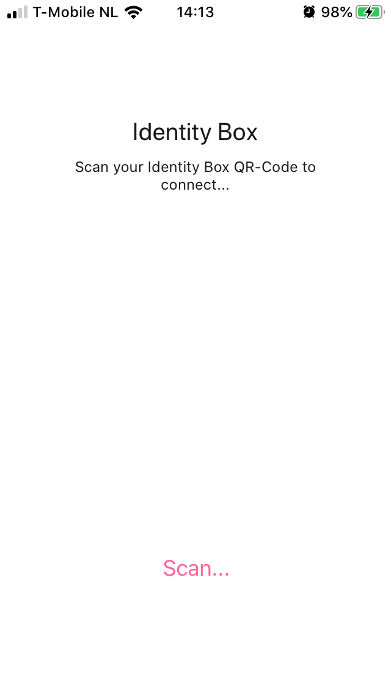
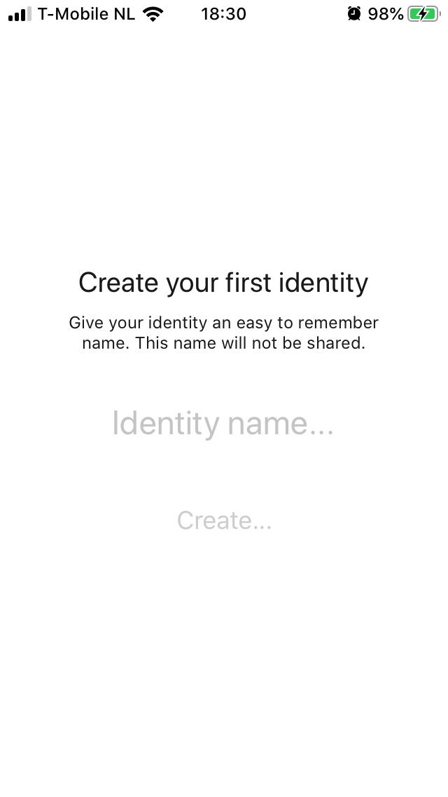
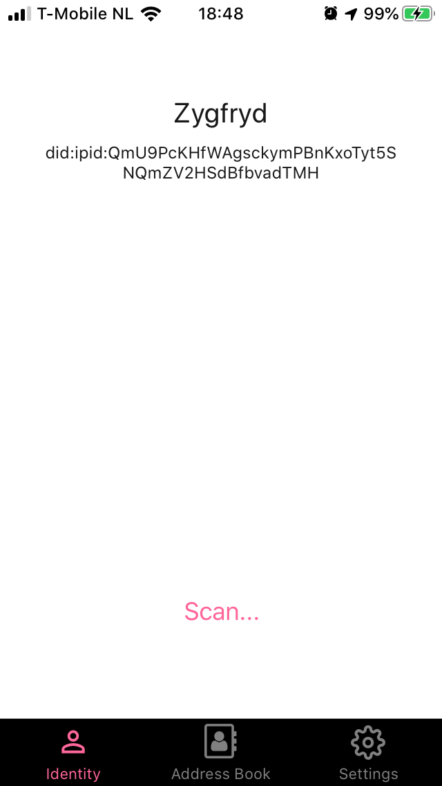
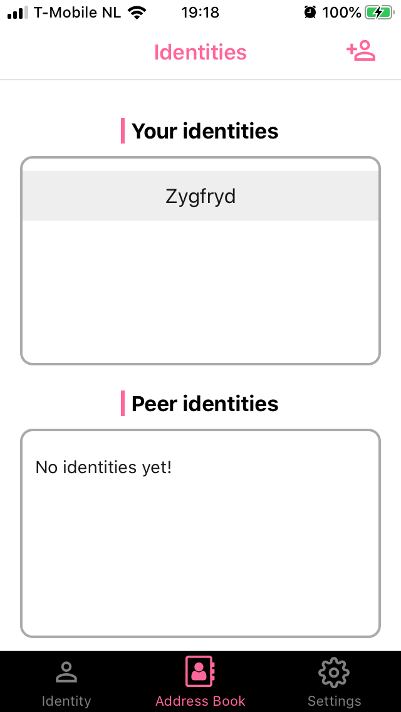
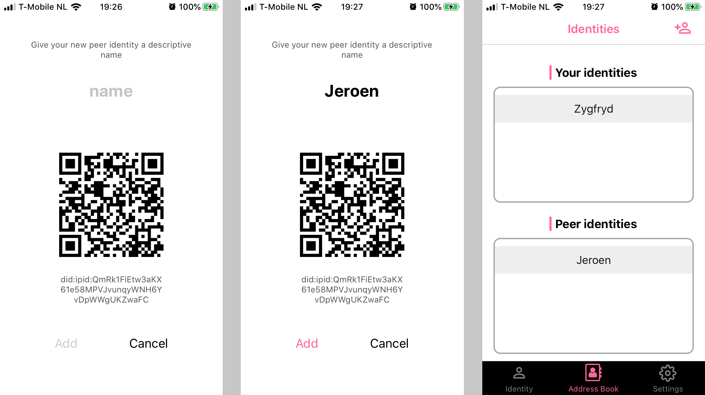
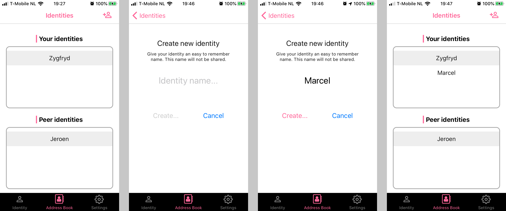
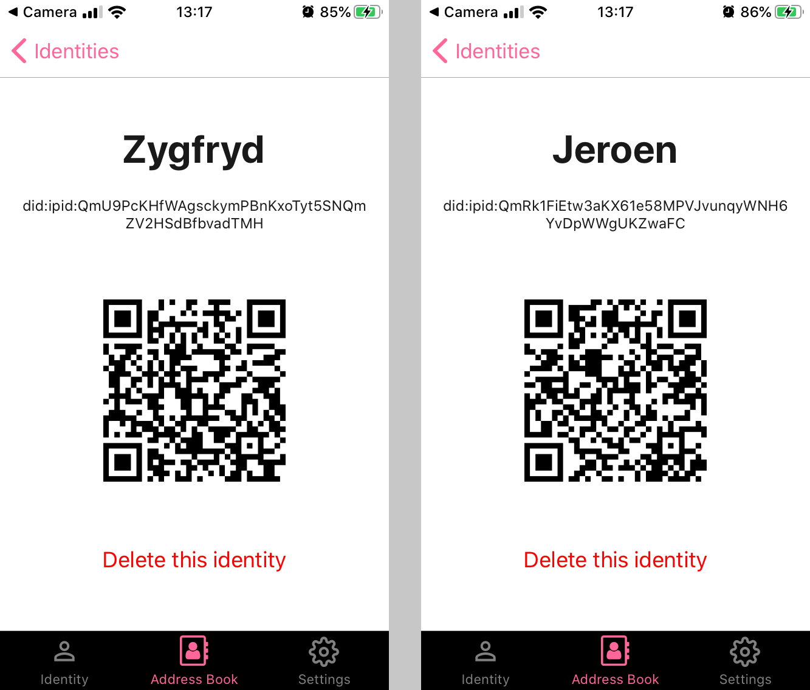

> You can join our Early Access Program by subscribing at [https://mailchi.mp/d0a5998cc646/identity-box-eap](https://mailchi.mp/d0a5998cc646/identity-box-eap).

If you are invited to our Early Access Program via [TestFlight](https://developer.apple.com/testflight/) (iOS) or [Expo](https://expo.io) (Android, coming soon) you can help us evaluating Identity Box even before actual boxes are made available.

For this purpose, specially for our early adopters, we created a *virtual* Identity Box that can be used when testing the IdentityBox app.

When you start your IdentityBox app for the first time, you will be asked to scan your Identity Box's QRCode in order to establish a one-to-one connection between your Identity Box app and your Identity Box:

 

  

<b>Figure 1</b> Connect to Identity Box

Here, we want you to use our virtual Identity Box by scanning the following QRCode:

 

  

<b>Figure 2</b> Virtual Identity Box QRCode

After scanning this QRCode, you will be able to create your first identity. Identity App allows for multiple identities, here you create your very first one:

 

  

<b>Figure 3</b> Create your first identity

Enter your first identity name and tap _Create_.

> The identity name is not shared with anyone. It is only present on your mobile so that it is easier for you to distinguish one name from another.

After your first identity is successfully created, you will see the following screen (here I used the name *Zygfryd*):

 

  

<b>Figure 4</b> Current Identity View

You can now also open *Address Book* tab, to see your own, and your peer identities:

 

  

<b>Figure 5</b> Address Book

By selecting an identity in the address book, you can see its details, and more importantly, you can share
identity with your peers by letting them scan the QRCode visible in the Identity Details view.

You add peer identities to your address book by scanning the QRCode of your peer from the Identity tab and then by adding a descriptive name for your new *contact* - this new name never leaves your mobile.

 

  

<b>Figure 6</b> Adding Peer Identity

In order to create another identity (i.e. your own identity) tap on the _Create New Identity_ icon in the top-right part of the navigation bar in the _Address Book_ tab:

 

  

<b>Figure 7</b> Creating a new identity

Finally, you can also delete identity by first tapping on the given identity in the _Address Book_ tab and then by tapping on _Delete this identity_ button. This works the same way for both you own identities and you peer identities, except that when you delete your own identity, it is also removed from your identity box.

 

  

<b>Figure 8</b> Identity Details: deleting identities

Identity App also provides the _Settings_ tab, where you can enable backups and reset your app and identity box. Please consult [Automatic Backups](/backups) to learn more.

You can already experience using Identity Box app in a real-life app. We built a simple secret sharing portal called *Hush Hush*, where you can securely exchange secrets with your peers. Please visit <a href="https://idbox.online/hush-hush" target="_blank">Hush Hush</a> and follow
the instructions.

> Hint - you can exchange secrets between your own identities as well - e.g. you can use Hush Hush to share secrets with yourself.

We appreciate your all your feedback and we thank you for helping us build the self-sovereign identity system of the future!

  
Your *Identity Box team*

