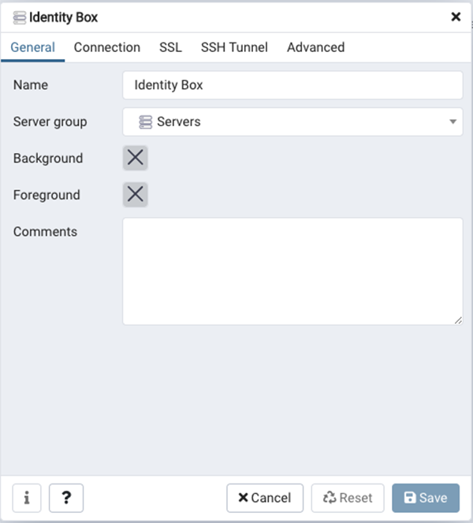
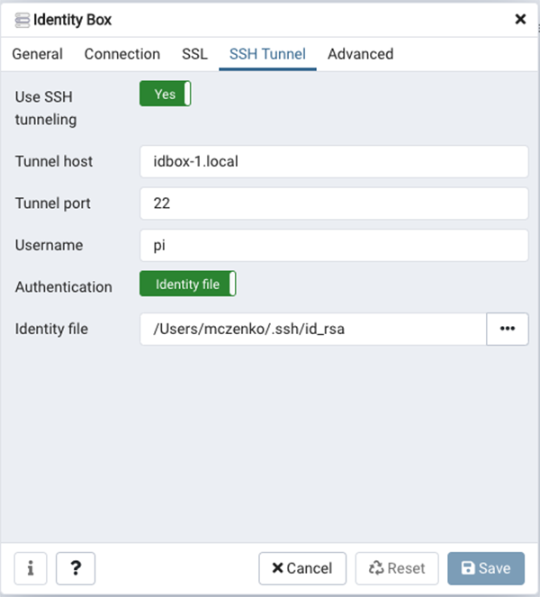
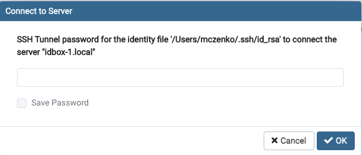

Identity Box grows and storing various configuration data in plain text files not only becomes hard to manage but also does not scale, especially with simultaneous write access.

## Installation on odroid and generic hardware

Following the instructions from https://www.postgresql.org/download/linux/ubuntu/ should be enough. I validated it on Odroid (ARM) and it worked without any surprises. Thus, it should be safe to assume (I will validate it soon) that it will work even beter any generic hardware supporting ubuntu (Intel-based in particular).

The instructions in this document has been validated on the most recent version of PostgreSQL, version 16, but from my past experiences with version 11, I expect that any version including and above version 11 will not pose any serious problems.

The main PostgreSQL configuration file - `postgresql.conf` - is located at `/etc/postgresql/16/main/`. The _PostgreSQL Client Authentication Configuration File_ `pg_hba.conf`, which we will need when configuring PostgreSQL authentication, can be found at the same location. Its location can also be retrieved by running in the terminal:

```bash
$ sudo su postgres
postgres@idbox-1:/home/idbox$ psql
psql (16.1 (Ubuntu 16.1-1.pgdg20.04+1))
Type "help" for help.

postgres=# SHOW hba_file;
              hba_file
-------------------------------------
 /etc/postgresql/16/main/pg_hba.conf
(1 row)

postgres=# q
postgres@idbox-1:/home/idbox$ exit
```

In earlier versions of PostgreSQL, the installation script provided additional information about how to enable and start PostgreSQL as a service (see the next section [Installation On RaspberryPi](#installation-on-raspberrypi)). This should not be needed anymore. After installing PostgreSQL, the service should be already configured and enable. In case of doubt, the service can be enabled by running:

```bash
$ sudo systemctl enable postgresql
```

To check the status of the PostgreSQL service run:

```bash
$ sudo systemctl status postgresql
● postgresql.service - PostgreSQL RDBMS
     Loaded: loaded (/lib/systemd/system/postgresql.service; enabled; vendor preset: enabled)
     Active: active (exited) since Thu 2023-11-16 00:13:45 CET; 4min 33s ago
    Process: 1114 ExecStart=/bin/true (code=exited, status=0/SUCCESS)
   Main PID: 1114 (code=exited, status=0/SUCCESS)

Nov 16 00:13:45 idbox-1 systemd[1]: Starting PostgreSQL RDBMS...
Nov 16 00:13:45 idbox-1 systemd[1]: Finished PostgreSQL RDBMS.
```

Follow Section [PostgreSQL and authentication](#postgresql-and-authentication) to continue.

## Installation On RaspberryPi

> In the past, the overall support for ARM architecture with popular software could pose some challenges. PostgreSQL was not exception here and this is why I still keep this section as a reference. It should not be needed anymore, but maybe someone will find it still useful. It was written some time ago, when PostgreSQL was at version 11.

We followed the [instructions](https://www.postgresql.org/download/linux/ubuntu/) from the regular Ubuntu distribution, with just a few exceptions.

The instruction:

```bash
$ sudo sh -c 'echo "deb http://apt.postgresql.org/pub/repos/apt $(lsb_release -cs)-pgdg main" > /etc/apt/sources.list.d/pgdg.list'
```

caused some troubles on our RaspberryPi. It basically adds a file `/etc/apt/sources.list.d/pgdg.list` with the following content:

```bash
deb http://apt.postgresql.org/pub/repos/apt buster-pgdg main
```

Unfortunately, when we then run:

```bash
$ wget --quiet -O - https://www.postgresql.org/media/keys/ACCC4CF8.asc | sudo apt-key add -
OK
```

followed by

```bash
$ sudo apt-get update
Hit:1 http://raspbian.raspberrypi.org/raspbian buster InRelease
Hit:2 http://archive.raspberrypi.org/debian buster InRelease
Get:3 https://dl.yarnpkg.com/debian stable InRelease [17.1 kB]
Hit:4 http://apt.postgresql.org/pub/repos/apt buster-pgdg InRelease
Fetched 17.1 kB in 1s (11.7 kB/s)
Reading package lists... Done
N: Skipping acquire of configured file 'main/binary-armhf/Packages' as repository 'http://apt.postgresql.org/pub/repos/apt buster-pgdg InRelease' doesn't support architecture 'armhf'
```

we get the above mentioned error. 

We decided to remove the `/etc/apt/sources.list.d/pgdg.list` and then the complete set of instructions to instal PostgreSQL on RaspberryPi is:

```bash
$ wget --quiet -O - https://www.postgresql.org/media/keys/ACCC4CF8.asc | sudo apt-key add -
$ sudo apt-get update
$ sudo apt install postgresql
...
The following additional packages will be installed:
  libllvm7 libpq5 postgresql-11 postgresql-client-11 postgresql-client-common postgresql-common ssl-cert sysstat
creating subdirectories ... ok
selecting default max_connections ... 100
selecting default shared_buffers ... 128MB
selecting default timezone ... Europe/Amsterdam
selecting dynamic shared memory implementation ... posix
creating configuration files ... ok
running bootstrap script ... ok
performing post-bootstrap initialization ... ok
syncing data to disk ... ok

Success. You can now start the database server using:

    pg_ctlcluster 11 main start

Ver Cluster Port Status Owner    Data directory              Log file
11  main    5432 down   postgres /var/lib/postgresql/11/main /var/log/postgresql/postgresql-11-main.log
update-alternatives: using /usr/share/postgresql/11/man/man1/postmaster.1.gz to provide /usr/share/man/man1/postmaster.1.gz (postmaster.1.gz) in auto mode
Setting up postgresql (11+200+deb10u4) ...
Processing triggers for systemd (241-7~deb10u4+rpi1) ...
Processing triggers for man-db (2.8.5-2) ...
Processing triggers for libc-bin (2.28-10+rpi1) ...
```

Finally, we figure out how to start the service:

```bash
pi@idbox-1:~ $ pg_ctlcluster 11 main start
Warning: the cluster will not be running as a systemd service. Consider using systemctl:
  sudo systemctl start postgresql@11-main
Error: You must run this program as the cluster owner (postgres) or root
pi@idbox-1:~ $ sudo systemctl start postgresql@11-main

sudo pg_ctlcluster 11 main status
pg_ctl: server is running (PID: 6677)
/usr/lib/postgresql/11/bin/postgres "-D" "/var/lib/postgresql/11/main" "-c" "config_file=/etc/postgresql/11/main/postgresql.conf"

pi@idbox-1:~ $ sudo systemctl status postgresql@11-main
● postgresql@11-main.service - PostgreSQL Cluster 11-main
   Loaded: loaded (/lib/systemd/system/postgresql@.service; enabled-runtime; vendor preset: enabled)
   Active: active (running) since Fri 2021-02-19 10:34:31 CET; 8min ago
 Main PID: 6677 (postgres)
    Tasks: 7 (limit: 4915)
   CGroup: /system.slice/system-postgresql.slice/postgresql@11-main.service
           ├─6677 /usr/lib/postgresql/11/bin/postgres -D /var/lib/postgresql/11/main -c config_file=/etc/postgresql/11/m
           ├─6682 postgres: 11/main: checkpointer
           ├─6683 postgres: 11/main: background writer
           ├─6684 postgres: 11/main: walwriter
           ├─6685 postgres: 11/main: autovacuum launcher
           ├─6686 postgres: 11/main: stats collector
           └─6687 postgres: 11/main: logical replication launcher

Feb 19 10:34:27 idbox-1 systemd[1]: Starting PostgreSQL Cluster 11-main...
Feb 19 10:34:31 idbox-1 systemd[1]: Started PostgreSQL Cluster 11-main.
```

From the above, we also read the location of the PostgreSQL configuration file: `/etc/postgresql/11/main/postgresql.conf`. We will need it later.

For now, we will need to edit other file: _PostgreSQL Client Authentication Configuration File_. To find its location, run:

```bash
$ sudo su postgres
postgres@idbox-1:/home/pi$ psql
psql (11.10 (Raspbian 11.10-0+deb10u1))
Type "help" for help.

postgres=# SHOW hba_file;
              hba_file
-------------------------------------
 /etc/postgresql/11/main/pg_hba.conf
(1 row)

postgres=# q
postgres-# \q
postgres@idbox-1:/home/pi$ exit
```

We record the file location: `/etc/postgresql/11/main/pg_hba.conf`.

## PostgreSQL and authentication

Right after the installation, we can only access it from the localhost using a so called [peer authentication](https://www.postgresql.org/docs/current/auth-peer.html):

> The peer authentication method works by obtaining the client's operating system user name from the kernel and using it as the allowed database user name (with optional user name mapping). This method is only supported on local connections.

Thanks to the peer authentication method we can conveniently access our database without any password by just doing `sudo su postgres` as shown above.

> Notice, that we have a database user named `postgres` as well as an operating system user account also named `postgres`. This is required for the `peer` authentication method where we require that the same username in the operating system as in PostgreSQL. This works only for local connection in UNIX. See also [PostgreSQL: Remove password requirement for user postgres](https://dba.stackexchange.com/a/83233/224568) on Database Administrators on StackExchange.

When using the peer authentication method for the default superuser `postgres`, in order to run a command on a database we have to do something like:

```bash
$ sudo -u postgres psql -c "\l"
# or
$ sudo -u postgres psql -c "SELECT datname FROM pg_database;"
# or
$ sudo su postgres -c 'psql -c "\l"'
# or
$ sudo su postgres -c 'psql -c "SELECT datname FROM pg_database;"'
```

And even though you have `psql` utility locally installed, you cannot just run:

```bash
$ psql -U postgres postgres
psql: FATAL:  Peer authentication failed for user "postgres"
```

> `postgres` is both the username and a default database on the PosgreSQL DBMS.


For this to work, you would have to set password on the database user `postgres`, but we do not want to do that. As indicated [here](https://stackoverflow.com/a/40151841/1272679), a better option is to create another superuser account. That way, if the credentials for that superuser is compromised, one can always ssh into the actual database host and manually delete the superuser using:

```bash
$ sudo -u postgres psql -c "DROP ROLE superuser;"
```

By not setting the password on the `postgres` user, we guarantee that we will never have all our superusers compromised: when you don't set the password, any password login attempt to `postgres` user will be denied whereas you can still use `sudo -u postgres psql -c` locally to get the job done.

Thus, if we want to use psql locally, or if we want to enable remote access to our database, we will need to add another user role.

Before adding a new role, let's make sure that we use the most secure variant of the password authentication which is `scram-sha-256` (it is more secure than legacy `md5`). To make the default, we set `password_encryption` in `/etc/postgresql/16/main/postgresql.conf` so that it reads as follows:

```bash
password_encryption = scram-sha-256     # md5 or scram-sha-256
```

Now restart the PostgreSQL server:

```bash
sudo systemctl restart postgresql
```

Now we can create a new role `admin` that we will use to remotely perform database
administration.

```bash
$ sudo su postgres
postgres@idbox-1:/home/pi$ createuser -s -d -P -e admin
Enter password for new role:
Enter it again:
SELECT pg_catalog.set_config('search_path', '', false)
CREATE ROLE admin PASSWORD 'md5739b151e6c6444592dc86f07b44ebde3' SUPERUSER CREATEDB CREATEROLE INHERIT LOGIN;
postgres@idbox-1:/home/pi$ psql
psql (11.10 (Raspbian 11.10-0+deb10u1))
Type "help" for help.

postgres=# \du
                                   List of roles
 Role name |                         Attributes                         | Member of
-----------+------------------------------------------------------------+-----------
 admin     | Superuser, Create role, Create DB                          | {}
 postgres  | Superuser, Create role, Create DB, Replication, Bypass RLS | {}
```

Superuser get `CREATEROLE` attributes assigned by default. We do not need it and then we will remove it:

```bash
postgres=# ALTER ROLE admin NOCREATEROLE;
ALTER ROLE
postgres=# \du
                                   List of roles
 Role name |                         Attributes                         | Member of
-----------+------------------------------------------------------------+-----------
 admin     | Superuser, Create DB                                       | {}
 postgres  | Superuser, Create role, Create DB, Replication, Bypass RLS | {}

postgres=#
```

Now we edit the `/etc/postgresql/16/main/pg_hba.conf` where we set authentication options for the new `admin` role:

```bash
local   all   postgres    peer
local   all   admin       scram-sha-256
```

> Make sure to restart the PostgreSQL service after changing the configuration files.

Having the _admin_ user properly configured, lets create even more restricted user role that will be used by Identity Box services:

```bash
$ sudo su postgres
postgres@idbox-1:/home/idbox$ createuser -P -e idbox
Enter password for new role:
Enter it again:
SELECT pg_catalog.set_config('search_path', '', false);
CREATE ROLE idbox PASSWORD 'SCRAM-SHA-256$4096:+uQKWsbuItKvVtPb/e0Kmg==$XT4os8G5xP8uZ+tU04bMAa1GYuHy7vSK2R6DSAFFDlY=:f51Djrbc7vTfYlHAhj9AKTsQBZo/DOjUJaqhjsc+iY8=' NOSUPERUSER NOCREATEDB NOCREATEROLE INHERIT LOGIN NOREPLICATION NOBYPASSRLS;
postgres@idbox-1:/home/idbox$ psql
psql (16.1 (Ubuntu 16.1-1.pgdg20.04+1))
Type "help" for help.

postgres=# \du
                             List of roles
 Role name |                         Attributes
-----------+------------------------------------------------------------
 admin     | Superuser, Create DB
 idbox     |
 postgres  | Superuser, Create role, Create DB, Replication, Bypass RLS

postgres=# \q
postgres@idbox-1:/home/idbox$
```

Finally, in the same terminal, lets create a database for Identity Box:

```bash
postgres@idbox-1:/home/idbox$ createdb -e -O idbox idboxdb
SELECT pg_catalog.set_config('search_path', '', false);
CREATE DATABASE idboxdb OWNER idbox;
postgres@idbox-1:/home/idbox$
```

With new `idbox` role added, we can now run:

```bash
$ psql -U idbox idboxdb
Password for user idbox:
psql (16.1 (Ubuntu 16.1-1.pgdg20.04+1))
Type "help" for help.

idboxdb=> \q
```

## macOS client

Following [macOS packages](https://www.postgresql.org/download/macosx/) page from PostgreSQL documentation, we can download a macOS installer [here](https://www.enterprisedb.com/downloads/postgres-postgresql-downloads).

The installer will create `PostgreSQL 16` folder in `/Applications`. It will also install a handy *pgAdmin 4* application and command line tools (and some other useful stuff).

> If for any reason the bundled *pgAdmin 4* application has issues working on macos (like when it looks like doing nothing after double-clicking the app icon). If this happens, a solution may be to install *pgAdmin 4* directly from https://www.postgresql.org/ftp/pgadmin/pgadmin4/.

We tested version `7.8` of *pgAdmin 4* and here are the installation settings we used:

<a id="figure-1"></a> 
<div class="scrollable flex-wrap responsive">
<div class="content-600">
  
</div>
</div>
<div class="flex-wrap responsive">
<p class="figure-title"><b>Figure 1</b> PostgreSQL installer setting on macos</p>
</div>

The additional installation instructions can be found on page [Installation of PostgreSQL on Mac OS](https://www.enterprisedb.com/postgres-tutorials/installation-postgresql-mac-os).

> When using separate installation of *pgAdmin 4*, the command line tools can be accessed at `/Applications/pgAdmin\ 4.app/Contents/SharedSupport/`.


## Enabling remote connections

> We document here how to do it, but we advice against it. A more secure way is to use an SSH tunnel (described in the next section).

Before we can make a remote connection to our database, we need to enable it. This applies also to remote connection using an SSH tunnel (described in the next section).

In order to enable it, we edit the `/etc/postgresql/16/main/pg_hba.conf` file and make sure we add the following line:

```bash
hostssl   all   all   samenet   scram-sha-256
```

Now, you should be able to connect using the `admin` role:

```bash
$ /Library/PostgreSQL/16/bin/psql -h idbox-1.local -p 5432 -U admin idboxdb
Password for user admin:
psql (16.1 (Ubuntu 16.1-1.pgdg20.04+1))
Type "help" for help.

idboxdb=#
```

Notice that if you try to connect using the `postgres` role, you will receive a bit misleading message:

```bash
$ /Library/PostgreSQL/16/bin/psql -h idbox-1.local -p 5432 -U postgres idboxdb
Password for user postgres:
psql: error: FATAL:  password authentication failed for user "postgres"
FATAL:  no pg_hba.conf entry for host "fe80::10f4:3ecb:fb6d:eede%eth0", user "postgres", database "idboxdb", SSL off
```

Specifically, the line saying:

```bash
FATAL:  no pg_hba.conf entry for host "fe80::10f4:3ecb:fb6d:eede%eth0", user "postgres", database "idboxdb", SSL off
```

indicates we could add the following to our `pg_hba.conf` file. Yet, adding the following line:

```bash
hostnossl   all   postgres  fe80::10f4:3ecb:fb6d:eede/32    scram-sha-256
```

would give us the following:

```bash
$ /Library/PostgreSQL/16/bin/psql -h idbox-1.local -p 5432 -U postgres idboxdb
Password for user postgres:
psql: error: FATAL:  password authentication failed for user "postgres"
FATAL:  password authentication failed for user "postgres"
```

Looks like the client first tries to authenticate using ssl, but not being able to it falls back to clear text, but fails here as well. Which is good, because we do not even set a password for the `postgres` user, and we did it for a good reason. We will get a similar error if we try to use psql directly on the localhost (where the PostgreSQL server runs):

```bash
pi@idbox-1:~ $ psql -U postgres test_db
psql: FATAL:  Peer authentication failed for user "postgres"
```

although here, the peer authentication mode is used.

To wrap up, we remove the added `hostnossl` entry from the `pg_hba.conf` file. Then we will also remove entry:

```bash
hostssl   all   all   samenet   scram-sha-256
```

effectively disabling the direct remote access to our database. In the next section, we will describe how to use an SSH tunnel to securely connect to our database.

## Using SSH tunnel to access your database remotely

Using SSH tunnel is easy and secure way of connecting to your database remotely. First create a tunnel:

```bash
$ ssh -L 50000:localhost:5432 idbox@idbox-1.local
```

Here, option `-L 50000` sets the local tunnel port to be `50000`. On the remote, we connect to `5432`: the default port of the PostgreSQL server.

Now we can `psql` to `localhost` on port `50000` and work just as if we were on the remote:

```bash
$ /Library/PostgreSQL/16/bin/psql -h localhost -p 50000 -U idbox idboxdb
```

Make sure that you do not use the following:

```bash
$ ssh -L 50000:idbox-1.local:5432 idbox@idbox-1.local
```

In such a case, the remote PostgreSQL server would see the connection as if it is coming from the local network (e.g. `192.168.1.15`) rather than from the `localhost`. This would require you to enable the remote connection as we describe in the section above, and this is rather not what you want.

Notice though that we still need to use the `admin` or `idbox` role to connect as the password authentication method will be used in this case. We consciously decided not to set the password for the default superuser `postgres` to keep it well protected.

See [Secure TCP/IP Connections with SSH Tunnels](https://www.postgresql.org/docs/current/ssh-tunnels.html) for more information.

## Using pgAdmin to connect to PostgreSQL database

pgAdmin also allows us to conveniently setup a tunnel. Right click on the _Servers_ and select _Register_ and then _Server..._ from the menu. In the dialog that opens, in the _General_ tab we fill in the name of the server (here it is `Identity Box`).

<a id="figure-2"></a> 
<div class="scrollable flex-wrap responsive">
<div class="content-600">
  
</div>
</div>
<div class="flex-wrap responsive">
<p class="figure-title"><b>Figure 2</b> Server setup - General tab</p>
</div>

Then in the _Connection_ tab we set:

<a id="figure-3"></a> 
<div class="scrollable flex-wrap responsive">
<div class="content-600">
  
</div>
</div>
<div class="flex-wrap responsive">
<p class="figure-title"><b>Figure 3</b> Server setup - Connection tab</p>
</div>

Here notice, that we set the hostname to be `localhost`: this is because we will be using the SSH tunnel. Port refers to the port on which the database is listening on the remote server (default is usually `5432`). As maintenance database we set the default database that has been created when PostgreSQL was installed and set up.

Finally, we set up the SSH tunnel (in the example below, we use a different hostname than we used previously in the examples):

<a id="figure-4"></a> 
<div class="scrollable flex-wrap responsive">
<div class="content-600">
  
</div>
</div>
<div class="flex-wrap responsive">
<p class="figure-title"><b>Figure 4</b> Server setup - SSH Tunnel tab</p>
</div>

We are now ready to connect. After you _Save_ the server configuration, _pgAdmin 4_ client should connect to your server.
When you restart the app, you need to reconnect by double clicking the _Identity Box_ server group. You will be asked for the password associated with the SSH key that you provided in the _SSH Tunnel_ tab:

<a id="figure-5"></a> 
<div class="scrollable flex-wrap responsive">
<div class="content-600">
  
</div>
</div>
<div class="flex-wrap responsive">
<p class="figure-title"><b>Figure 5</b> Connecting to the server - SSH Key Password</p>
</div>

Enter your password (or leave it empty if your key does not have associated password) and hit _OK_.

pgAdmin is now connected to your remote database using an SSH Tunnel.

For more information how to connect to the PostgreSQL database check [Connecting PostgreSQL using psql and pgAdmin](https://www.enterprisedb.com/postgres-tutorials/connecting-postgresql-using-psql-and-pgadmin).

<style scoped>
.scrollable {
  width: 100%;
  overflow-x: auto;
}
.flex-wrap {
  display:flex;
  flex-flow:column;
  justify-content:center;
  align-items: center;
}
@media (max-width: 650px) {
  .responsive {
    align-items: flex-start;
  }  
}
.figure-title {
  font-size: 0.8em
}
.bordered-content-600 {
  width: 600px;
  border: 1px solid black;
}
.content-600 {
  width: 600px;
}
.bordered-content-300 {
  width: 300px;
  border: 1px solid black;
}
</style>
