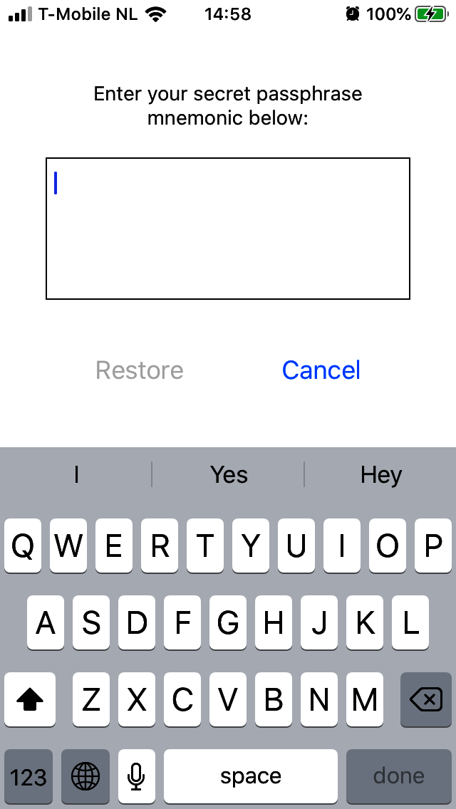
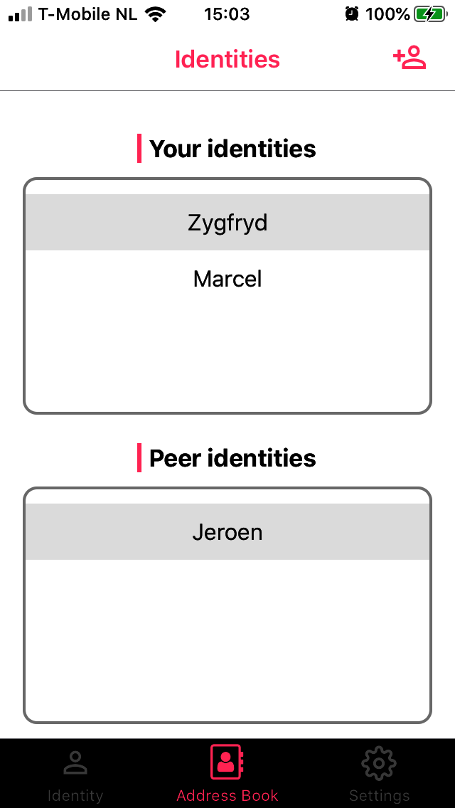

Being able to backup the identities is obviously a necessity - in the end you may lose your phone, or you just got a new one, or you use more than one device (we do not cover this case yet).

Even in an early stage as we are, we need the possibility to backup and restore the identities, so that our testers can easily restore their environment in case they had to reinstall the app. Without even a basic backup and restore functionality, testing is hard and can quickly become inconvenient.

## What needs to be preserved?

For successful restoration of the user's environment, we need to backup things that are on the user's IdApp (mobile), and things that are on the user's Identity Box.

### What to preserve from the IdApp

IdApp keeps the most precious secrets - the private keys associated with each of your identities. They should never leave the mobile in clear. You also need preserve all your peers identities that you added previously to your address book - you do not want to do it again (at least without a reason). We therefore create an encrypted bundle containing all your own identities and your peer identities.

This encrypted bundle needs an encryption key. We generate this key for you and after the whole backup process finishes we present you a passphrase mnemonic.

> The passphrase mnemonic needs to be kept off-line. The passphrase mnemonic needs to be protected. Without it, not only you won't be able to restore your environment but it make live of the attacker much easier. Of course, the passphrase without the encrypted backup itself is not very useful and for this reason we recommend that the encrypted backup has to be kept safe as well. For this reason, we store the encrypted backup on your identity box. In particular, we do not store it on IPFS as we cannot be certain that we can remove it later if needed. Using the desktop app you will be able to extract the backup from your identity box and put it everywhere you like. We recommend that you keep it off-line - for instance on a usb stick. If you decided to keep it on some online storage, make sure you have control over it - in particular that you can delete it. This way, even if you change your keys, everything that you encrypted in the past will be safe even if attacker acquires your passphrase mnemonic.

> At this early stage we only provide a shared Identity Box. Thus, we will regularly take care for your backups, and in the future, you will be able to extract your backups from your Identity Box using a convenient desktop app. Currently, the most important role of the backups is to make testing more convenient.

After creating the encrypted bundle of your identities, we store the encrypted bundle on your Identity Box.
When Identity Box records the encrypted backup from your mobile, it will also backup its own part.

### What to preserve from the Identity Box

Your Identity Box keeps your decentralized identifiers (DIDs) and the corresponding DID Documents. Recall that a DID is an IPNS name which itself represents a cryptographic key pair. Identity Box encrypts all such keys and adds the encrypted keys to the backup (we encrypt it because we want them to be extra protected when you extract your backup from your Identity Box in order to have a safe copy of it). It also adds all your DID documents to the backup (unencrypted, as they only contain public content anyway).

### Backups are automatic

After you enable backups, we will create a new backup every time you add or remove a new identity (your own or peer identity). In short, a new backup creation is triggered every time your address book changes. To make it happen, we keep the backup key securely stored on your mobile. The backup key will be deleted when you disable the automatic backups or when you perform a factory reset.

## Automatic backups step-by-step

Backup options are available in the _Settings_ tab:

 

  

<b>Figure 1</b> Settings tab

Here, you can enable automatic backups and after short while the backup will be created, stored on your Identity Box, and the passphrase mnemonic will be presented to you:

 

  

<b>Figure 2</b> Passphrase mnemonic

To, test your new backup, you can now perform the factory reset:

 

  

<b>Figure 3</b> Factory reset

after which, you will need re-establish the connection with your Identity Box, by scanning its QRCode again:

 

  

<b>Figure 4</b> Scan Identity Box QRCode

After connecting to your Identity Box, the app will check if any backups are available on it, and - if so - it will give you an option to _Restore from backup..._:

 

  

<b>Figure 5</b> Restore from backup

After selecting _Restore from backup..._ you will be asked to enter your passphrase mnemonic (the same you safely recorded in the previous step):

 

  

<b>Figure 6</b> Enter passphrase mnemonic

You confirm with _Done_ button on the keyboard. The integrity of your mnemonic will be checked by the app, and if the mnemonic appears to be correct, the _Restore_ button will be enabled.

 

  

<b>Figure 7</b> Passphrase mnemonic correct

If the integrity check fails for any reason, you will receive feedback and opportunity to correct the mnemonic before you can proceed:

 

  

<b>Figure 8</b> Passphrase mnemonic incorrect

Notice that the fact that the integrity of the mnemonic has been confirmed does not mean that the backup kept on your Identity Box corresponds to this mnemonic - this will be checked just after you tap on _Restore_. If the backup found on the device does not match your passphrase mnemonic, it will be communicated to the user:

 

  

<b>Figure 9</b> No backup available for the given passphrase mnemonic

On the other hand, when there is a backup on your Identity Box that corresponds to the passphrase mnemonic you entered, your address book will be correctly restored:

 

  

<b>Figure 10</b> Restoring from backup successful

  
Your *Identity Box team*

