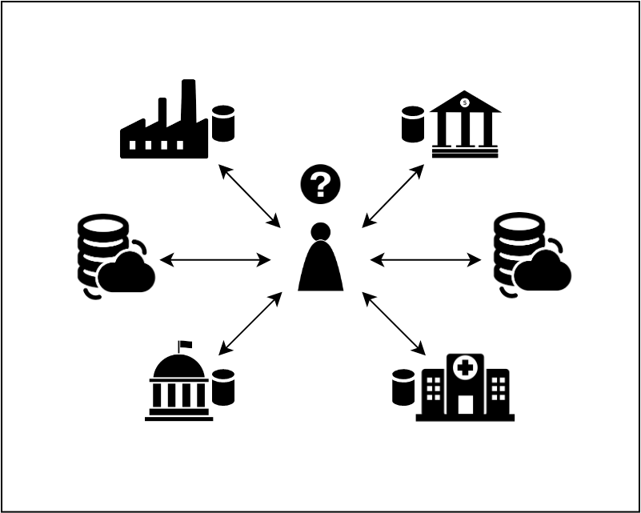
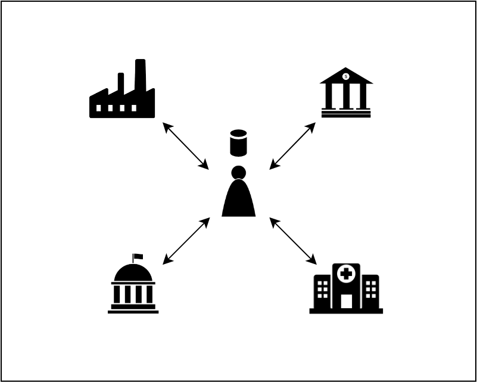

> This is still a work in progress document, which will later be published as the Identity Box white paper.

Currently most of the data belong to just a handful of companies. Personal documents, photographs, videos, things that we put online in general, contain lots of sensitive information. Information that we would rather prefer to stay private. Very often the same companies that provide more or less "complimentary" storage space for our disposal, also help us managing our whole digital existence. Services commonly known as "Login with..." are common as they seem to simplify the management of our digital life. The combination of the data and the identity information is a powerful combination which empowers well-established business models where the user's data becomes a product. Additionally this concentration of data kept by well-known service providers makes it easier than ever for the illegal institutions, but also the state, to gain insights into the data that they have no rights to access.

We observe that the customers are becoming increasingly more aware of the importance of protecting their digital content and it is becoming clear that the current centralized model has came to an end.

## Decentralized Web

The modern web is built on the so called **client/server** model. A client is usually a computer (but in general can be anything that has the means of connecting to the Internet) that requests the information from the server. The server, often after validating the rights of the requester to access the requested content, sends the content back to the user's computer where the data is rendered in a browser or processed otherwise. What's important to realize is that in this centralized model, no matter how many clients attempt to connect to a server, the server will try to serve each one of them without the clients ever talking to each other. This model naturally presents serious scalability problems and is also a serious threat to the security and privacy. A server in the client/server architecture quickly becomes a single point of failure and the current web is founded on such a single point of failure.

The alternative is the *decentralized web*. In the decentralized web the content is distributed among so called *peers* in a Peer-to-Peer network (abbreviated P2P). Each peer can add content to the network and each peer can retrieve content from it. When adding the content to a P2P network a peer often does not even know where (meaning on which physical node) the content will actually be stored. This is often even  more true for large content, like video files, which are split into smaller block and then the underlying P2P network determines the actual physical location of each block. But then, if we do not know where the content really is, how can we retrieve it?

When adding content to a P2P network the network determines how to distribute the content over a set of nodes. This selection of nodes is based on the content itself and this is why we say that the storage is *content addressable*. To make retrieval of the content possible, the network returns the user a *content identifier* - a hash-like identifier that uniquely identifies the content on the web. The content identifier is *immutable*. Any change in the content results in a new content identifier. This improves content integrity and makes tempering with the content harder. Data versioning, increased speed and better use of the bandwidth are also common characteristics of P2P networks.

P2P networks enable a new, decentralized model of the Internet, pulling the data out from a few big centers and distributing it over the whole decentralized network.

Let's take a look how distributed storage infrastructure may change the way we deal with data today.

## Decentralized Data

As already mentioned above, in the data storage playground, the dominating role is played by big data storage providers, like Amazon, Google, or Dropbox, to name a few most prominent. Lots of **our** data is also stored by the state, healthcare organizations, financial institutions, and corporations in general. In many cases, the owner of the data does not have any control of data, often not even being able to access it. All the world data are either kept by institutions that we do not trust, or sparingly distributed over very few data centers. [Figure 1](#figure-1) depicts the current situation:

<a id="figure-1"></a> 
<div class="flex-wrap">
<div class="bordered-content">
  
</div>
<p class="figure-title"><b>Figure 1</b> Current Situation</p>
</div>

In order to access the data that the user owns, the user needs to individually query every data depositary. Removing the data is often hard if not impossible. The user is a de-facto hostage of the data depositary.

The current situation has one more disadvantage. Every institution storing the data has not only its own policies, but also uses proprietary technologies to access the data. It means that not only the user, but also any other involved party wanting to access the user's data at organization *X* needs to resort to specific technology on a case-by-case basis. For the user, often the least equipped from the whole constellation, it means learning to use and maintain a number of applications - one per organization in the worst case scenario. Each organization in [Figure 1](#figure-1) will also apply its own access control policies and authentication technologies, which puts even more burden on the user. 

A more intuitive arrangement would be to store the data by the data owner - the user -  as presented in [Figure 2](#figure-2).

<a id="figure-2"></a> 
<div class="flex-wrap">
<div class="bordered-content">
  
</div>
<p class="figure-title"><b>Figure 2</b> User in control</p>
</div>

Here, we see that the user is in control, but we may also immediately realize a danger of this approach. If every single user would use a different technology to provide access to the data, the situation would be equally bad, if not worse.

A final proposal would be that all users, but also institutions, some of them storing the data on behalf of users, all participate in one overlay P2P network ([Figure 3](#figure-3)).

<a id="figure-3"></a> 
<div class="flex-wrap">
<div class="bordered-content">
  
</div>
<p class="figure-title"><b>Figure 3</b> Overlay P2P Network</p>
</div>

In this approach everyone's data is persisted using a uniform, generic infrastructure, enabling sophisticated data-driven, user-centric solutions that would be hard if not possible to build in the centralized model. 

> The future of the data storage will be distributed. We envision a world where not only access to the (unsupervised) Internet, but also the storage space are not a luxury, but a human rights. We believe that within next 20 years a society will arrive at solution that will make storage unlimited, affordable, always available, secure, and privacy preserving.

In order to convince the data owners to entrust their data to a global, generic, distributed P2P network, the users need to be assured that their data are secured and that their privacy is respected. What we need are the authentication and authorization mechanisms that are natively integrated in the very nature of the distributed network. Such controlled, user-centric access to the data requires a special type of identity. Existing identity solutions are centralized in their nature - user identity is entrusted to the service providers themselves or to the centralized identity services. Such centralized approach inherits the scalability problems typical to all centralized solutions, but more importantly does not let the user to have full and exclusive control of the user's online identity.

## Digital Identity for Decentralized Web

Decentralized web deserves a matching concept of digital identity. As the content becomes distributed so also our identity should return to where it belongs: to the users.

Self-sovereign identity is a new term describing the concept of identity that is fully owned and fully controlled by individual. Christopher Allen in [The Path to Self-Sovereign Identity](http://www.lifewithalacrity.com/2016/04/the-path-to-self-soverereign-identity.html) identifies *Ten Principles of Self-Sovereign Identity*: existence, control, access, transparency, persistence, portability, interoperability, consent, minimization, and protection.

In the heart of self-sovereign identity we have [Decentralized Identifiers (DIDs)](https://w3c-ccg.github.io/did-spec/) - identifiers that are fully under control of the DID subject. DIDs are identifiers (or special URLs) that relate a DID subject with the available means for trustable interactions with that subject.

Let's take the following example. Alice wants to exchange some confidential information (a file) with Bob. Technically, the solution is simple: Alice encrypts the file using Bob's public key, and additionally signs the encrypted content using her private key. Bob then uses Alice's public key to verify the signature and then decrypts the file with his private key. This process works smoothly as long as Alice and Bob have each other's public keys. Moreover, users need to build trust between them: Alice need to trust that the public key that she thinks belongs to Bob, actually does. This is what we call a *web of trust* - a concept used in PGP, GnuPG, and other OpenPGP-compatible systems to establish the authenticity of the binding between a public key and its owner. The problem of key distribution is hard on its own, but we believe that Decentralized Identifiers will make it easier to deal with.

Each DID resolves to a DID Document that describes where and how the corresponding DID can be used. This is how Alice, knowing Bob's DID, can learn Bob's public key.

How a DID resolves to a DID document is described in the so-called *DID method*, which defines how a specific DID scheme can be implemented using a specific technology. A [DID Method registry](https://w3c-ccg.github.io/did-method-registry/#the-registry) lists all the registered DID methods.

The DID method is referenced in the DID itself: a DID is a string starting with `did:`, followed by the *method* string, and the method specific identifier itself. This way DID remains self-descriptive.

Most DID methods require a distributed ledger technology (DLT) or other decentralized P2P network with similar capabilities. The two DID methods that stand out are [DID method for Ethereum](https://github.com/uport-project/ethr-did-resolver/blob/develop/doc/did-method-spec.md) and [Interplanetary Identifiers](https://did-ipid.github.io/ipid-did-method/).

In the DID method for Ethereum, a method specific identifier is created by prepending `did:ethr:` to a valid Ethereum address. A big advantage of this DID method is that such DID can be created completely off-line. Resolving a DID reduces to basically calling a `resolve` smart contract function providing a DID as an argument. The did resolver takes the Ethereum address, checks for the current owner, looks at contract events then builds and returns the resulting DID document.

A disadvantage of a DID based on Ethereum is that it needs Ethereum. We would prefer that identity is an integral part of the underlying P2P network, not an addition build on top of it. Security and privacy as a default, not a fancy optional.

## DIDs for IPFS

The DID method for Interplanetary Identifiers is based on [IPLD](https://ipld.io) - the data model of the content-addressable web that brings interoperability between different content-addressable protocols. IPLD is used in [IPFS](https://ipfs.io) - Interplanetary File System - to structure and link all the data chunks/objects. In simple terms, IPFS is a content addressable distributed storage, where the physical location of the stored content depends on the content itself.

Because IPFS is a content addressable distributed network, it features a resolver built-in, which together with [IPNS](https://docs.ipfs.io/guides/concepts/ipns/) - Interplanetary Name System - makes IPFS a powerful foundation to provide a global uniform infrastructure for identity and storage.

Creating a DID in IPFS starts with creating an initial version of a DID document - for instance one listing a public key of the DID subject. This DID document is then added to the network and the resulting content identifier (called a CID - a hash with some metadata) is given back to the user. As already mentioned above, any update to this DID document will result in a new CID. A CID therefore cannot directly be used as a DID. What we need is a binding between the DID and the most recent version of the corresponding DID document. This is what *IPNS* - Interplanetary Name System - is for. IPNS provides a record that binds an IPNS name with the given CID. The process of creating an IPNS name is called *publishing*. The IPNS name has limited lifetime and needs to be renewed before it becomes invalid. These helps keeping IPFS clean from obsolete and unused names.

What is an IPNS name under the hood? An IPNS name is hash of a public key belonging to an IPFS node. Each IPNS node has an associated key-pair. When publishing a name, the hash of the node's public key is used as an IPNS name. The owner of the node can create additional key-pairs in order to publish more IPNS names.

An IPNS name therefore becomes a DID on IPFS. Every time the user updates the corresponding DID document, the document needs to be republished under the same IPNS name, so that the IPNS name points to the most recent version of the DID document.

As we see, everything we need to create and to maintain a DID is already part of the underlying infrastructure - IPFS P2P network - which in our vision can result in a much more scalable and uniform approach to global identity system than DID based on the Ethereum method. What makes IPFS even more suitable is that it is based on IPLD, which makes the concept of addressable web scaling well across different domains - for instance, a DID document can easily refer to an Ethereum transaction hash or to a git commit.

## Introducing Identity Box

In order to take advantage of the distributed internet of the future, each participating user needs to own an IPFS node extended with self-sovereign identity and potentially other user-tailored services.

The IdBox is a physical device that the user connects to his personal home network. In the minimal version it runs an instance of the IPFS node and a number of our own custom services (e.g. Name Service, Identity Service, Rendezvous, Box Office). Together with the accompanying identity (mobile) app, the IdBox provides a self sovereign identity service that can be used in combination with other services. Being an full-fledged IPFS node, IdBox provides access to all IPFS services. Using the accompanying identity app and in the future also a desktop app, the user will be able to securely and conveniently store the user's own content, and by extending IdBox via external storage (a drive can be directly connect to the box itself, or a special service app can be used to share the content from the storage available on desktop and laptop computers). Finally, an IdBox makes it possible to install and run other, third-party apps directly on the box. These apps can extend and complement the IPFS and the provided identity service with other user-specific capabilities: healthcare, home automation, home security, and personal hosting are just to most obvious the examples. IdBox will help us to start changing from the centralized internet to a powerful distributed network of the future.

## Some technology aspects

It is crucial that more and more users own a physical IPFS node. Only the owner of a node can add content and publish names - which means that only an owner of an IPFS node can create an IPFS-based DID.

Creating an IPFS node is not technically challenging - one can even create one within a browser, even on a mobile device. Such node is perfect to interact with IPFS network, but may not be sufficient to guarantee continuous availability of the stored content and so also of the created DIDs. Using so called pinning-services is not really an alternative - as one cannot guarantee required features, like publishing names. Finally, for the success of the IPFS network, it needs more and more physical nodes - not the nodes running on global cloud providers' infrastructure like Amazon or Google.

### Technology behind IPFS

The most important part of IPFS is the underlying Distributed Hash Table (DHT).

[Distributed Hash Tables] (DHT) represent a class of overlay P2P systems with key-based routing functionality. They provide a look up service similar to a hash table. In a DHT system, data are distributed across many *nodes*. Each node itself provides a hash table functionality: each block of data (a *value*) is identified by a *key*. One can store a new key and value pair or, knowing the key, one can read the associated value. The node storing the value corresponding to the given key can be usually identified by this key. For instance, in the [Kademlia] DHT system each node is identified by a *nodeID* which is a 160-bit binary number. The key has the same format as the nodeID. A key in Kademlia DHT system (and also in most of other DHT proposals) is a hash (Kademlia uses 160-bit SHA1 digest) of the value (a data block to be stored under the given key). In a typical DHT lookup operation, the nodeID is determined first based on the key and then the same key is used to read the corresponding data. Therefore, the user may not be aware of the actual storage location for the data. Kademlia extends the [Chord] DHT system, improving on relation between provable consistency and performance, latency-minimizing routing, and unidirectional topology. Last, but not least, Kademlia allows for much less complex implementation comparing to e.g. Chord. Because of these advantages Kademlia became a DHT of choice for many other systems requiring DHT (e.g. [BitTorrent]). Other important DHT proposals are [Pastry] and [Tapestry].

[Distributed Hash Tables]: http://doi.acm.org/10.1145/383059.383072
[Kademlia]: http://www.ic.unicamp.br/~bit/ensino/mo809_1s13/papers/P2P/Kademlia-%20A%20Peer-to-Peer%20Information%20System%20Based%20on%20the%20XOR%20Metric%20.pdf
[Chord]: http://doi.acm.org/10.1145/383059.383071
[Pastry]: https://link.springer.com/content/pdf/10.1007/3-540-45518-3_18.pdf
[Tapestry]: http://zoo.cs.yale.edu/classes/cs426/2012/bib/zhao04tapestry.pdf
[BitTorrent]: https://www.bittorrent.com

### How does IdBox work

In designing IdBox our most important concern is the user security and privacy. To support this claim the most important invariant when designing the IdBox is that only the owner of the IdBox has write access to the box. 

The user connects to the IdBox using a mobile app. The connection between the mobile app and the IdBox is established during the box setup. Each box runs a so called [Rendezvous service](/services/rendezvous). Rendezvous service has two important functions:

1. It allows the box owner to directly connect to the box.
2. It allows creating a so called _tunnel_ between Identity App and a web app running in a browser.

Rendezvous service has public url.

> We did not decide yet how we will make this convenient for the user. For our virtual box this is of course not an issue, but we need to make it easy for the owner of a physical box to either receive a domain name from us (or any other box provider), let the user to conveniently associate his own domain, or use a _DynamicDNS_ service. _No vendor lock-in_ is the principle here.

The user will connect the Identity Box to his router (currently via regular Ethernet cable, we can consider wireless connection as well for a more convenient setup).

### Creating identity with idbox and mobile app

We know that an IPNS name is simply a hash of a key. We can see the hashes of currently available keys by issuing the following ipfs command from the
IPFS node:

```bash
$ ipfs key list -l
k2k4r8pdw2o63cw436h1sx91fq0wcvwiv8zihxydw5jllg14d6pvjitx self
k2k4r8lkezjykb4ty8sv0yzzk29omf09r9rljz6onfnjj0abhh6b13f4 1571676385721O3etAS4D5X6Yuw
k2k4r8o8hveyjw6i1w9ezbqc39fqofsaewlwu6srwqmp3t9i25q3ngn3 1571680020616cJq-qjd4orX1cw
```

First column is a public key encoded in a content identifier format (CIDv1: `base36` encoded using `libp2p-key` codec). The second column is the associated name. `self` designates the node itself and is automatically created by IPFS when the node is bootstrapped. The other keys are the keys either created by the user or created when an IPNS name is published (`ipfs name publish` command). Thus, a CID-encoded key is a valid IPNS name. Here `k2k4r8lkezjykb4ty8sv0yzzk29omf09r9rljz6onfnjj0abhh6b13f4` can be used as an IPNS name, and `k2k4r8o8hveyjw6i1w9ezbqc39fqofsaewlwu6srwqmp3t9i25q3ngn3` can be used as an IPNS name as well. The associated name is a composition of a timestamp and a random string. By doing this, we make sure that the friendly descriptions as seen in the Identity App never leave the mobile.

It is also important to emphasize that an identity is being created on the Identity Box, but the corresponding private keys reside on the mobile device only.

Thus, each new identity is created on the mobile device. Creating an identity currently involves creating an encryption and signing key-pairs, creating identity on the Identity Box, and persisting (on IPFS via IdBox) the corresponding DID document including the corresponding signing and encrypting public keys (the private keys stay in the mobile app). The content identifier (CID) corresponding to the created DID Document is then associated with the user identity using IPNS.

> The current implementation of IPNS is still work in progress and therefore subject to change. [DNSLink](https://docs.ipfs.io/guides/concepts/dnslink/) can also be used alone and in combination with IPNS to provide human readable names for the published content.

<br/><br/>
Your *Identity Box team*

<style scoped>
.scrollable {
  width: 100%;
  overflow-x: auto;
}
.flex-wrap {
  display:flex;
  flex-flow:column;
  justify-content:center;
  align-items: center;
}
.figure-title {
  font-size: 0.8em
}
.bordered-content {
  width: 600px;
  border: 1px solid black;
}
@media (max-width: 650px) {
  .bordered-content {
    width: 300px;
  }  
}
</style>